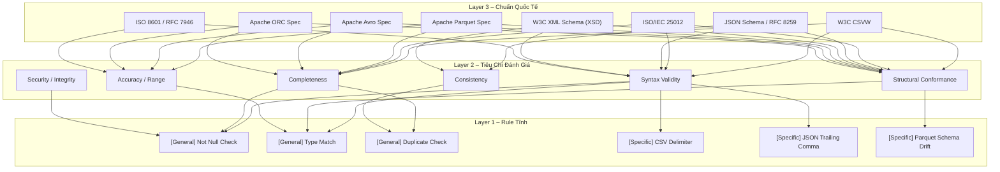
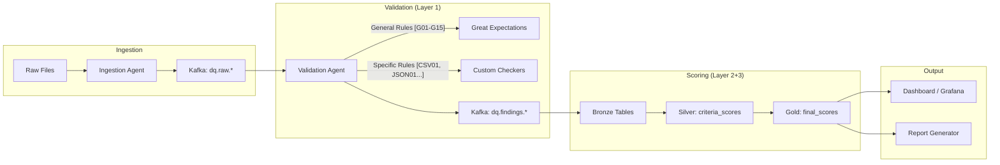

## 1. Tổng Kết Yêu Cầu 

> [!IMPORTANT]
> **Bài toán cốt lõi:** Nâng cấp từ "bắt lỗi thô" → "Chấm điểm theo chuẩn Quốc tế" với kiến trúc 3 lớp:
> - **Layer 3 (Top):** Chuẩn quốc tế cho từng loại data
> - **Layer 2 (Middle):** Tiêu chí đánh giá (criteria) của chuẩn đó
> - **Layer 1 (Bottom):** Rule tĩnh triển khai (General + Specific)



---

## 2. Mapping Chuẩn Quốc Tế → Loại Data

| Data Type | Chuẩn Quốc Tế (Layer 3) | Mô Tả Ngắn |
|---|---|---|
| **CSV / TSV** | **W3C CSVW** + **ISO/IEC 25012** | Dialect, encoding, header, datatype, completeness |
| **JSON / JSONL** | **JSON Schema (Draft 2020-12)** + **RFC 8259** | Syntax validity, structural conformance, nested validation |
| **XML** | **W3C XML Schema (XSD 1.1)** | Namespace, element hierarchy, content model, data types |
| **Parquet** | **Apache Parquet Format Spec** + **ISO/IEC 25012** | Schema evolution, column types, metadata integrity |
| **Avro** | **Apache Avro Spec 1.12** | Writer-reader compatibility, union/logical types |
| **ORC** | **Apache ORC Spec** | Decimal/timestamp compatibility, stripe-level integrity |
| **XLSX / XLS** | **ISO/IEC 29500 (OOXML)** + **ISO/IEC 25012** | Workbook structure, cell semantics, date serials |
| **Fixed-width** | **NOAA GHCN Spec** (domain) + **ISO/IEC 25012** | Offset layout, sentinel values, line length |
| **TXT / Log** | **Syslog RFC 5424** + **ISO/IEC 25012** | Timestamp format, log level, message parsing |
| **GeoJSON** | **RFC 7946** | FeatureCollection, geometry, coordinate validity |
| **OSM** | **OSM XML/PBF Spec** | Node/way/relation, tag completeness |
| **Archives** | **ZIP/GZIP Spec** + **ISO 8000** | Checksum, member integrity, path traversal safety |

---

## 3. Tiêu Chí Đánh Giá (Layer 2) & Trọng Số

> [!NOTE]
> Trọng số được thiết kế theo nguyên tắc ISO 8000: **Syntax → Semantic → Pragmatic**.
> Mỗi loại data có bộ trọng số riêng vì tính chất khác nhau.

### 3.1 Bộ 6 Tiêu Chí Chung (áp dụng cho mọi data type)

| ID | Tiêu Chí | Ký Hiệu | Mô Tả ISO/IEC 25012 |
|---|---|---|---|
| C1 | **Syntax Validity** | `SYN` | Data tuân thủ đúng cú pháp định dạng (parseable, well-formed) |
| C2 | **Structural Conformance** | `STR` | Data khớp schema/contract kỳ vọng (cột, kiểu, nesting) |
| C3 | **Completeness** | `CMP` | Tỷ lệ field/record có giá trị (không null/missing) |
| C4 | **Consistency** | `CST` | Data không mâu thuẫn nội bộ (duplicate, cross-field logic) |
| C5 | **Accuracy / Range** | `ACC` | Giá trị nằm trong domain/range hợp lệ |
| C6 | **Security / Integrity** | `SEC` | File an toàn, không corrupt, checksum khớp |

### 3.2 Ma Trận Trọng Số Theo Data Type

| Data Type | SYN | STR | CMP | CST | ACC | SEC | Tổng |
|---|---|---|---|---|---|---|---|
| CSV | 25% | 25% | 20% | 15% | 10% | 5% | 100% |
| JSON/JSONL | 30% | 25% | 15% | 15% | 10% | 5% | 100% |
| XML | 25% | 30% | 15% | 15% | 10% | 5% | 100% |
| Parquet | 10% | 30% | 25% | 15% | 15% | 5% | 100% |
| Avro | 10% | 35% | 20% | 20% | 10% | 5% | 100% |
| ORC | 10% | 35% | 20% | 15% | 15% | 5% | 100% |
| XLSX | 15% | 25% | 25% | 15% | 15% | 5% | 100% |
| Fixed-width | 30% | 25% | 20% | 10% | 10% | 5% | 100% |
| TXT/Log | 30% | 20% | 15% | 15% | 15% | 5% | 100% |
| GeoJSON | 20% | 25% | 20% | 15% | 15% | 5% | 100% |
| OSM | 15% | 25% | 25% | 15% | 15% | 5% | 100% |
| Archives | 10% | 10% | 10% | 5% | 5% | 60% | 100% |

---

## 4. Danh Sách Rule Tĩnh (Layer 1)

### 4.1 Rule Chung (General) — Áp dụng cho NHIỀU data types

| Rule ID | Rule Name | Tiêu Chí | Mô Tả | Áp Dụng Cho |
|---|---|---|---|---|
| G01 | `not_null_check` | CMP | Field bắt buộc không được null/empty | ALL |
| G02 | `type_match` | STR | Giá trị khớp kiểu dữ liệu kỳ vọng | ALL |
| G03 | `duplicate_check` | CST | Không có record trùng lặp theo key | ALL |
| G04 | `row_count_range` | CMP | Số dòng nằm trong khoảng kỳ vọng | ALL |
| G05 | `encoding_utf8` | SYN | File encoding là UTF-8 hợp lệ | CSV, JSON, XML, TXT, Fixed-width |
| G06 | `bom_detection` | SYN | Phát hiện và cảnh báo BOM header | CSV, JSON, TXT |
| G07 | `timestamp_parseable` | ACC | Timestamp parse được theo ISO 8601 | ALL (có timestamp) |
| G08 | `numeric_range` | ACC | Giá trị số nằm trong domain range | ALL (có numeric) |
| G09 | `date_order_check` | CST | start_date <= end_date | ALL (có date pair) |
| G10 | `column_count_stable` | STR | Mỗi dòng/record cùng số field | CSV, TSV, TXT, Fixed-width |
| G11 | `string_length_check` | ACC | Chuỗi không vượt quá max length | ALL |
| G12 | `whitespace_trim` | SYN | Phát hiện leading/trailing whitespace bất thường | CSV, TXT, Fixed-width |
| G13 | `enum_membership` | ACC | Giá trị thuộc danh sách cho phép | ALL (có enum field) |
| G14 | `sha256_integrity` | SEC | Hash file khớp với manifest | ALL |
| G15 | `file_size_range` | SEC | Kích thước file trong khoảng hợp lệ | ALL |

### 4.2 Rule Đặc Thù (Specific) — Theo từng Data Type

#### CSV / TSV

| Rule ID | Rule Name | Tiêu Chí | Mô Tả |
|---|---|---|---|
| CSV01 | `delimiter_detection` | SYN | Nhận diện đúng delimiter (comma, tab, semicolon, pipe) |
| CSV02 | `header_presence` | STR | Phát hiện file có/không có header row |
| CSV03 | `quoted_newline` | SYN | Field có newline trong quote vẫn parse đúng |
| CSV04 | `embedded_separator` | SYN | Dấu phân cách trong quote không split sai |
| CSV05 | `comment_row_skip` | STR | Dòng comment (#) không bị coi là data |
| CSV06 | `field_count_distribution` | STR | Thống kê phân bố số cột mỗi dòng |
| CSV07 | `non_ascii_handling` | SYN | Ký tự non-ASCII decode đúng |

#### JSON / JSONL

| Rule ID | Rule Name | Tiêu Chí | Mô Tả |
|---|---|---|---|
| JSON01 | `json_parse_valid` | SYN | File parse thành công bằng json.loads() |
| JSON02 | `trailing_comma_reject` | SYN | Reject trailing comma theo RFC 8259 |
| JSON03 | `nested_depth_check` | STR | Depth không vượt quá threshold |
| JSON04 | `keyset_consistency` | CST | Keyset ổn định qua các record |
| JSON05 | `array_length_alignment` | CST | Các array song song cùng độ dài |
| JSON06 | `optional_key_rate` | CMP | Tỷ lệ key optional missing |
| JSON07 | `array_cardinality` | STR | Thống kê min/max/avg phần tử array |
| JSON08 | `jsonl_line_valid` | SYN | Mỗi dòng JSONL là JSON hợp lệ |
| JSON09 | `event_type_drift` | CST | Phát hiện payload schema thay đổi theo event type |

#### XML

| Rule ID | Rule Name | Tiêu Chí | Mô Tả |
|---|---|---|---|
| XML01 | `wellformed_check` | SYN | XML well-formed (parse không lỗi) |
| XML02 | `namespace_aware` | STR | Nhận diện và xử lý namespace đúng |
| XML03 | `xsd_validate` | STR | Validate theo XSD schema nếu có |
| XML04 | `attribute_completeness` | CMP | Tỷ lệ attribute bắt buộc có mặt |
| XML05 | `escaped_html_detect` | SYN | Phát hiện escaped HTML trong text node |
| XML06 | `nullable_attr_rate` | CMP | Tỷ lệ attribute nullable/missing |

#### Parquet

| Rule ID | Rule Name | Tiêu Chí | Mô Tả |
|---|---|---|---|
| PQ01 | `magic_number_check` | SYN | File bắt đầu+kết thúc bằng PAR1 |
| PQ02 | `schema_match` | STR | Schema khớp contract kỳ vọng |
| PQ03 | `schema_drift_detect` | CST | So sánh schema giữa các file/tháng |
| PQ04 | `null_rate_per_column` | CMP | Tỷ lệ null mỗi cột |
| PQ05 | `nested_column_audit` | STR | Kiểm tra list/struct/map columns |
| PQ06 | `negative_value_flag` | ACC | Flag giá trị âm bất thường |
| PQ07 | `zero_value_flag` | ACC | Flag giá trị 0 bất thường |
| PQ08 | `metadata_stats_check` | SEC | Footer statistics min/max hợp lý |

#### Avro

| Rule ID | Rule Name | Tiêu Chí | Mô Tả |
|---|---|---|---|
| AVRO01 | `container_magic` | SYN | File có magic header Obj1 |
| AVRO02 | `writer_schema_present` | STR | Object container có writer schema |
| AVRO03 | `union_field_check` | STR | Union fields có default hợp lệ |
| AVRO04 | `logical_type_check` | STR | Logical types (date, timestamp-millis) parse đúng |

#### ORC

| Rule ID | Rule Name | Tiêu Chí | Mô Tả |
|---|---|---|---|
| ORC01 | `orc_readable` | SYN | File đọc được bằng Arrow ORC reader |
| ORC02 | `decimal_precision` | ACC | Decimal precision/scale khớp kỳ vọng |
| ORC03 | `timestamp_tz_check` | ACC | Timestamp timezone xử lý đúng |
| ORC04 | `stripe_integrity` | SEC | Tất cả stripe đọc được không lỗi |

#### XLSX / XLS

| Rule ID | Rule Name | Tiêu Chí | Mô Tả |
|---|---|---|---|
| XLS01 | `sheet_count_check` | STR | Số sheet khớp kỳ vọng |
| XLS02 | `header_offset_detect` | STR | Nhận diện header row đúng (skip metadata) |
| XLS03 | `blank_cell_rate` | CMP | Tỷ lệ ô trống |
| XLS04 | `mixed_type_column` | STR | Phát hiện cột có nhiều kiểu dữ liệu |
| XLS05 | `date_serial_parse` | ACC | Date serial number parse thành datetime đúng |

#### Fixed-width

| Rule ID | Rule Name | Tiêu Chí | Mô Tả |
|---|---|---|---|
| FW01 | `line_length_stable` | SYN | Mọi dòng cùng độ dài ký tự |
| FW02 | `offset_extraction` | STR | Parse theo offset không dùng split |
| FW03 | `sentinel_detection` | CMP | Nhận diện sentinel value (-9999) là missing |
| FW04 | `element_code_valid` | ACC | Element/domain code thuộc danh sách hợp lệ |

#### TXT / Log

| Rule ID | Rule Name | Tiêu Chí | Mô Tả |
|---|---|---|---|
| LOG01 | `timestamp_extract` | SYN | Parse được timestamp từ mỗi dòng log |
| LOG02 | `level_distribution` | STR | Thống kê log level (error/warn/info) |
| LOG03 | `parse_success_rate` | SYN | Tỷ lệ dòng parse thành công bằng regex |
| LOG04 | `field_count_stable` | STR | Số field mỗi dòng ổn định |

#### GeoJSON

| Rule ID | Rule Name | Tiêu Chí | Mô Tả |
|---|---|---|---|
| GEO01 | `feature_collection` | STR | Root type là FeatureCollection |
| GEO02 | `geometry_present` | CMP | Mỗi feature có geometry |
| GEO03 | `coordinate_range` | ACC | lat ∈ [-90,90], lon ∈ [-180,180] |
| GEO04 | `geometry_type_whitelist` | ACC | Geometry type thuộc danh sách RFC 7946 |

#### OSM

| Rule ID | Rule Name | Tiêu Chí | Mô Tả |
|---|---|---|---|
| OSM01 | `element_type_valid` | STR | Element là node/way/relation |
| OSM02 | `node_latlon_present` | CMP | Node có lat và lon |
| OSM03 | `tag_completeness` | CMP | Tỷ lệ element có ít nhất 1 tag |

#### Archives

| Rule ID | Rule Name | Tiêu Chí | Mô Tả |
|---|---|---|---|
| ARC01 | `archive_openable` | SYN | Archive giải nén không lỗi |
| ARC02 | `path_traversal_check` | SEC | Không có member path chứa `../` |
| ARC03 | `executable_scan` | SEC | Không có file .exe/.sh/.bat trong archive |
| ARC04 | `checksum_verify` | SEC | Checksum MD5/SHA khớp với nguồn |

---

## 5. Công Thức Tính Điểm

### 5.1 Score per Criteria (Layer 2)

```
criteria_score(C_i) = Σ(rule_pass_rate_j) / count(rules_in_C_i)
```

Trong đó `rule_pass_rate_j` = số record PASS / tổng số record kiểm tra cho rule j.

### 5.2 Final Score per Standard (Layer 3)

```
final_score(dataset) = Σ(weight_i × criteria_score_i)   ∀ i ∈ {SYN, STR, CMP, CST, ACC, SEC}
```

### 5.3 Ví Dụ Cụ Thể

```
NYC TLC Parquet (Chuẩn: Apache Parquet Spec + ISO 25012)
├── SYN (10%): PQ01=100% → score = 100 × 0.10 = 10.0
├── STR (30%): PQ02=100%, PQ05=100%, G02=100% → avg=100 × 0.30 = 30.0
├── CMP (25%): G01=98.8%, PQ04=98.8% → avg=98.8 × 0.25 = 24.7
├── CST (15%): G03=100%, PQ03=100% → avg=100 × 0.15 = 15.0
├── ACC (15%): PQ06=99.3%, PQ07=98.8%, G08=99.3% → avg=99.1 × 0.15 = 14.9
├── SEC (5%): G14=100%, PQ08=100% → avg=100 × 0.05 = 5.0
└── TỔNG ĐIỂM = 99.6 / 100
```

---

## 6. Kiến Trúc Triển Khai Trên Hệ Thống Hiện Tại



> [!TIP]
> **Nguyên tắc Decoupling quan trọng:** Validation Agent (Layer 1) CHỈ bắn rule findings ra Kafka. Toàn bộ logic tính điểm nằm ở Gold Layer (dbt/SQL). Điều này giúp streaming không bị nghẽn CPU.

### 6.1 Kafka Message Format (chuẩn hóa)

```json
{
  "data_id": "nyc_tlc_yellow_2026_01",
  "data_type": "parquet",
  "rule_id": "PQ06",
  "rule_tag": "specific",
  "criteria": "ACC",
  "standard": "apache_parquet_spec",
  "total_records": 1000,
  "passed_records": 993,
  "pass_rate": 0.993,
  "details": {"negative_fare_count": 7},
  "timestamp": "2026-05-14T04:00:00Z"
}
```

---